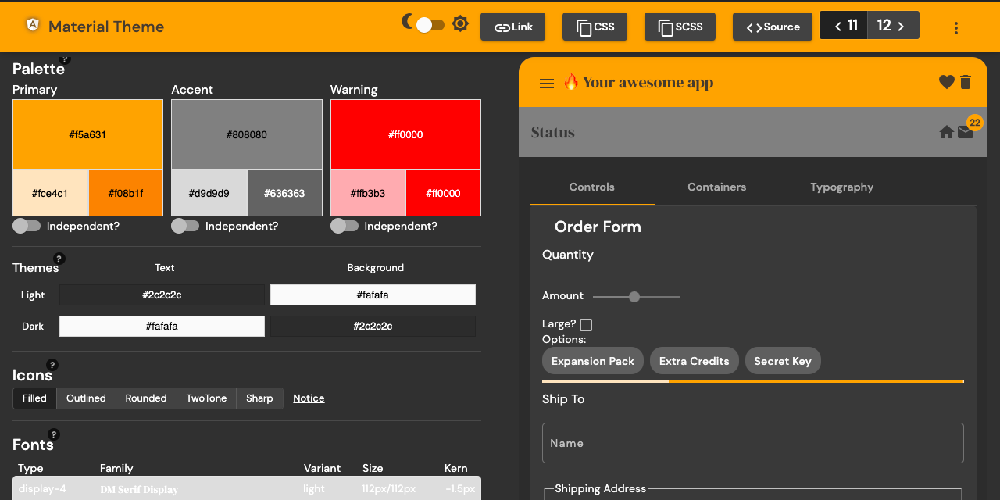

# mat-theme

mat-theme is an Angular PWA powered by Firebase.

- [Live Demo](https://mat-theme.web.app/)



## Features

- Angular 9.x + Firebase
- Installable PWA
- Angular Material + Theme

## Usage

1.  Run

- `git clone https://github.com/davidmimay/mat-theme.git mat-theme`
- `cd mat-theme`
- `npm install`

2.  Create a project at https://firebase.google.com/ and grab your web config:


3.  Add the config to your Angular environment

#### src/environments/

Update the `environment.prod.ts` and `environment.ts` files. 

```typescript
export const environment = {
  production: false,
  firebase: {
    apiKey: 'APIKEY',
    authDomain: 'DEV-APP.firebaseapp.com',
    databaseURL: 'https://DEV-APP.firebaseio.com',
    projectId: 'DEV-APP',
    storageBucket: 'DEV-APP.appspot.com',
    messagingSenderId: '...',
    appId: '...',
  }
};
```

5.  Run `ng serve`.

## Developing

🟠 Color name picker and preset colors on `colorpickercomponent.ts`
🟠 Color name table with background `[style.background]="weight"` on `preview-containers.component.ts`.

## Source

This project was made from https://nooglerway.web.app video lessons and courses. A highly recommended platform.

[<code>LEARN MORE 💻</code>](https://nooglerway.web.app)